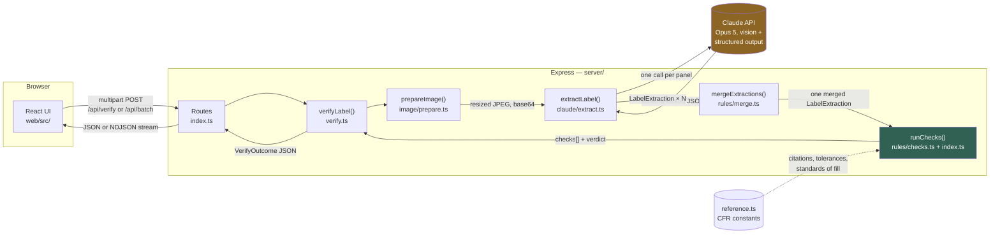

# Technical Documentation

Every file path, code excerpt, and API contract below was read live from the repository — not
reconstructed from memory. If the code changes, this document is expected to drift; treat the
source as authoritative and this as a map to it.

For the narrative version of this material (business context, stakeholder mapping, honest
limitations), see [`README.md`](../README.md). This document is the code-level companion: what
runs, in what order, and why each boundary sits where it does.

## Contents

- [System map](#system-map)
- [Request lifecycle](#request-lifecycle)
- [Backend](#backend)
  - [`server/config.ts` — configuration](#serverconfigts--configuration)
  - [`server/index.ts` — HTTP routes](#serverindexts--http-routes)
  - [`server/verify.ts` — pipeline orchestration](#serververifyts--pipeline-orchestration)
  - [`server/image/prepare.ts` — image preprocessing](#serverimagepreparets--image-preprocessing)
  - [`server/claude/` — the model boundary](#serverclaude--the-model-boundary)
  - [`server/rules/` — the decision layer](#serverrules--the-decision-layer)
  - [`server/pool.ts` — bounded concurrency](#serverpoolts--bounded-concurrency)
- [Frontend](#frontend)
  - [`web/src/App.tsx` — shell and health check](#websrcapptsx--shell-and-health-check)
  - [`web/src/types.ts` — the wire contract, client side](#websrctypests--the-wire-contract-client-side)
  - [`web/src/components/SingleCheck.tsx` — one label](#websrccomponentssinglechecktsx--one-label)
  - [`web/src/components/BatchCheck.tsx` — many labels](#websrccomponentsbatchchecktsx--many-labels)
  - [`web/src/components/ApplicationFields.tsx` — the cross-layer import](#websrccomponentsapplicationfieldstsx--the-cross-layer-import)
  - [`web/src/components/CheckCard.tsx` / `VerdictBanner.tsx` / `ImageDrop.tsx`](#websrccomponentscheckcardtsx--verdictbannertsx--imagedroptsx)
  - [`web/src/csv.ts` — manifest parsing and export](#websrccsvts--manifest-parsing-and-export)
- [API contract](#api-contract)
- [Dev vs. production wiring](#dev-vs-production-wiring)
- [Test layout](#test-layout)
- [Full file inventory](#full-file-inventory)

---

## System map



**The one fact this diagram exists to show:** everything left of `Merge` touches the network and
the model; everything from `Merge` onward is synchronous TypeScript with no I/O. `rules/` is
covered by 90 unit tests that never construct an `Anthropic` client.

---

## Request lifecycle

For a single-panel check (`POST /api/verify` with one image):

1. **`server/index.ts`** — `multer` parses the multipart body into memory (never to disk),
   validates the application JSON, calls `verifyLabel()`.
2. **`server/image/prepare.ts`** — `sharp` applies EXIF rotation, downscales to the model's
   2576px ceiling, re-encodes as JPEG, produces a 240px thumbnail for the UI.
3. **`server/claude/extract.ts`** — one `messages.create()` call with the image and a
   JSON-Schema-constrained `output_config.format`. The model is never asked whether the label is
   compliant — only what is printed.
4. **`server/rules/index.ts` → `checks.ts`** — nine pure functions run against the transcription
   and the application record. No network, no clock read past `performance.now()` for timing.
5. **`server/verify.ts`** — assembles the response, and conditionally re-reads the label once
   (see [the disputed-warning re-read](#the-disputed-warning-re-read)).
6. **`web/src/components/SingleCheck.tsx`** — renders the verdict, sorts findings by severity,
   offers CSV/JSON download.

For batch (`POST /api/batch`), step 1 additionally groups uploaded files into submissions
(`groupIntoSubmissions` in `index.ts`), and steps 2–5 run inside `mapWithConcurrency` (bounded at
`BATCH_CONCURRENCY`, default 6), writing one NDJSON line per completed label as it finishes.

---

## Backend

### `server/config.ts` — configuration

All runtime configuration in one object, read once from `process.env`. Two details worth
knowing:

```ts
function secret(name: string): string {
  const raw = process.env[name];
  if (!raw) return '';
  return raw.trim().replace(/^["']|["']$/g, '').trim();
}

export const config = {
  apiKey: secret('ANTHROPIC_API_KEY'),
  model: process.env.ANTHROPIC_MODEL ?? 'claude-opus-5',
  effort: process.env.EXTRACTION_EFFORT ?? 'low',
  thinking: process.env.EXTRACTION_THINKING === 'adaptive' ? 'adaptive' : 'disabled',

  get fallbackModel(): string {
    const explicit = process.env.ANTHROPIC_FALLBACK_MODEL;
    if (explicit) return explicit;
    return this.model === 'claude-opus-5' ? 'claude-sonnet-5' : 'claude-opus-5';
  },

  confirmDisputedWarning: process.env.CONFIRM_DISPUTED_WARNING !== 'false',
  maxImageEdge: int('MAX_IMAGE_EDGE', 2576),
  demoMode: process.env.DEMO_MODE === 'true',

  get hasApiKey(): boolean { return this.apiKey.length > 0; },
  get canRun(): boolean { return this.hasApiKey || this.demoMode; },
};
```

**`secret()` strips paste artifacts.** Found on the first real deployment: a key pasted into
Render's dashboard field carried surrounding quotes and a trailing newline. Both pass every "is
this set?" check and then fail at the API with a bare `invalid x-api-key`. Regression-tested in
[`test/pipeline.test.ts`](../test/pipeline.test.ts).

**`fallbackModel` is derived, not hardcoded.** A model tried once when the primary refuses a
request. If it defaulted to a fixed string, changing `ANTHROPIC_MODEL` to that same value would
silently make the fallback retry against itself.

All 12 environment variables are documented with their reasoning in
[`.env.example`](../.env.example) — that file is the single source of truth for what's
configurable and why; this document does not duplicate it.

### `server/index.ts` — HTTP routes

Three routes, no framework beyond Express itself:

| Route | Method | Purpose |
|---|---|---|
| `/api/health` | GET | Reports config state — used by the UI's mode banners and by deployment verification |
| `/api/verify` | POST | One label, 1–10 image panels |
| `/api/batch` | POST | Up to 500 images, optional CSV-derived application map, NDJSON streaming response |

**Upload limits**, set once at the top of the file:

```ts
const upload = multer({
  storage: multer.memoryStorage(),
  limits: { fileSize: 25 * 1024 * 1024, files: 500 },
});
```

`memoryStorage()` is the load-bearing choice for the privacy story in the README — no uploaded
image ever touches disk.

**Batch grouping** (`groupIntoSubmissions`) decides which uploaded files belong to the same
label:

```ts
function groupIntoSubmissions(
  files: Express.Multer.File[],
  applications: Record<string, ApplicationRecord>,
): Submission[] {
  const byApplication = new Map<string, Submission>();
  const submissions: Submission[] = [];

  files.forEach((file, index) => {
    const application = applications[file.originalname];
    if (!application) {
      submissions.push({ label: file.originalname,
        application: fallbackApplication(file.originalname, index), files: [file] });
      return;
    }
    const existing = byApplication.get(application.applicationId);
    if (existing) {
      existing.files.push(file);
      existing.label = existing.files.map((f) => f.originalname).join(' + ');
      return;
    }
    const submission = { label: file.originalname, application, files: [file] };
    byApplication.set(application.applicationId, submission);
    submissions.push(submission);
  });

  return submissions;
}
```

CSV rows sharing an `applicationId` become one submission. A `groupAll` form field (set by the
UI's "these are all photographs of one label" checkbox) bypasses this entirely for the common
case of checking a single bottle without a manifest.

**`fallbackApplication` returns empty fields, deliberately:**

```ts
function fallbackApplication(_fileName: string, index: number): ApplicationRecord {
  return {
    applicationId: `UNMATCHED-${index + 1}`,
    beverageClass: 'distilled_spirits',
    brandName: '',        // NOT the filename
    classType: '',
    // ...
  };
}
```

An earlier version put the filename in `brandName`. That made every unmatched label compare
`"TAYLOR"` against `"image-01.jpeg"` and report a brand-name violation — a false rejection
manufactured entirely by the tool's own placeholder data, found while testing against a real
bottle photograph. `checks.ts` now reports `not_compared` for an empty application value instead
of failing on it.

**Error handling** funnels through one function so every failure returns the same JSON shape:

```ts
function sendError(res: express.Response, err: unknown): void {
  if (res.headersSent) { res.end(); return; }
  if (err instanceof HttpError) {
    res.status(err.status).json({ error: err.message });
    return;
  }
  if (err instanceof ExtractionError) {
    res.status(err.code === 'no_api_key' ? 503 : 502).json({ error: err.message, code: err.code });
    return;
  }
  console.error(err);
  res.status(500).json({ error: 'Something went wrong on the server.' });
}
```

### `server/verify.ts` — pipeline orchestration

The function every route calls. Signature:

```ts
export async function verifyLabel(
  application: ApplicationRecord,
  panels: Panel[],           // { buffer: Buffer; fileName: string }[]
): Promise<VerifyOutcome>
```

Panels are prepared and read **concurrently**, not sequentially:

```ts
const prepared = await Promise.all(panels.map((p) => prepareImage(p.buffer)));
const reads = await Promise.all(
  prepared.map((image, index) => extractLabel(image, panels[index]!.fileName)),
);
```

A front and a back are independent model calls with no dependency between them — running them in
sequence would double the wait for no reason.

#### Panel agreement check

Before the rules engine runs, if more than one panel was supplied, `verify.ts` checks whether
they plausibly describe the same product:

```ts
const disagreements = panels.length > 1 ? conflicts(reads.map((r) => r.extraction)) : [];
if (disagreements.length > 0) {
  checks = [{
    id: 'panel_agreement',
    title: 'Do these images show the same bottle?',
    verdict: 'review',
    summary: `These images disagree on ${listFields(disagreements)}, which usually means ` +
      'they are photographs of different products...',
    // ...
  }, ...checks];
}
```

This exists because a stray photo from the *next* bottle along is an easy mistake to make when
selecting files, and merging panels from two different products would silently produce a
determination about a label that doesn't exist. Reported as `review`, not a violation — the
likely fault is the grouping, not the label itself.

#### The disputed-warning re-read

The most consequential piece of orchestration logic in the file:

```ts
if (!isDemo && config.confirmDisputedWarning && wordingMismatch(checks)) {
  const warningIndex = Math.max(0, reads.findIndex((r) => r.extraction.governmentWarningText != null));
  const second = await extractLabel(prepared[warningIndex]!, panels[warningIndex]!.fileName);

  const merged = mergeExtractions(reads.map((r, i) => i === warningIndex ? second.extraction : r.extraction));
  const secondPass = runChecks(application, merged);

  if (!wordingMismatch(secondPass.checks)) {
    // The two readings disagree with each other. Neither is trusted.
    checks = checks.map((check) => check.id === 'government_warning'
      ? { ...check, verdict: 'review', summary: 'The warning could not be read consistently...' }
      : check);
  }
}
```

**Why this exists:** benchmarking found the warning transcribed character-identical on 9 of 9
repeat reads, and one earlier run mis-read a single word on a label whose warning was actually
correct. A false positive on this specific check is the most expensive error the tool can make —
an agent sent to look at three warnings that turn out to be fine stops looking carefully at the
fourth.

**Why it costs nothing on the common path:** the re-read only fires when the first pass already
found a wording mismatch, so labels with a correct warning (the overwhelming majority) never
trigger a second API call.

**Why disagreement resolves to `review`, not to "pick the passing reading":** when two
independent reads of the same image disagree, the honest position is that the tool doesn't know
— not that it should quietly resolve in whichever direction happens to pass.

### `server/image/prepare.ts` — image preprocessing

```ts
export async function prepareImage(input: Buffer): Promise<PreparedImage> {
  const pipeline = sharp(input, { failOn: 'none' });
  const metadata = await pipeline.metadata();
  let work = pipeline.rotate();   // applies EXIF orientation, then strips it

  const longestEdge = Math.max(metadata.width ?? 0, metadata.height ?? 0);
  if (longestEdge > config.maxImageEdge) {
    work = work.resize({ width: config.maxImageEdge, height: config.maxImageEdge,
      fit: 'inside', withoutEnlargement: true });
  }

  const { data, info } = await work.jpeg({ quality: 90, mozjpeg: true }).toBuffer({ resolveWithObject: true });
  const thumbnail = await sharp(data).resize({ width: 240, height: 240, fit: 'inside' })
    .jpeg({ quality: 70 }).toBuffer();

  return { base64: data.toString('base64'), mediaType: 'image/jpeg', width: info.width,
    height: info.height, thumbnailDataUrl: `data:image/jpeg;base64,${thumbnail.toString('base64')}`,
    transformations };
}
```

Three operations, each earning its place:

1. **`.rotate()` with no argument** — phone photos routinely carry an EXIF orientation flag that
   naive pipelines ignore, producing a sideways label. This is the highest-value fix in the file
   and it's free.
2. **Downscale to 2576px** — the model's native resolution ceiling; sending more is pure upload
   latency with no accuracy gain, since the API downscales anyway.
3. **Re-encode as JPEG** — a 300-label batch of 12MP phone PNGs would dominate wall-clock time
   on upload alone.

Deliberately **not** done: contrast normalization, sharpening, deskewing. Each risks destroying
the low-contrast fine print the tool exists to read; the model handles those conditions better
than a fixed filter would.

### `server/claude/` — the model boundary

**`schema.ts`** defines the JSON Schema Claude's response is constrained to
(`output_config.format`), and the system prompt. The schema has 18 required fields, all
nullable except `imageLegible`, `imageQualityIssues`, and `transcriptionConfidence`. The prompt's
governing line:

```
Your only job is to report what is physically printed on the label. You are not evaluating
compliance and you are not comparing anything to an application.
```

Every instruction after that reinforces transcription-only behavior: preserve capitalization
exactly, never correct spelling, report `null` rather than infer, transcribe the government
warning character-for-character *without reproducing the standard text from memory*.

**`extract.ts`** makes the actual API call:

```ts
async function callModel(model: string, image: PreparedImage) {
  const modern = supportsEffortAndThinking(model);
  return await getClient().messages.create({
    model,
    max_tokens: 8192,
    system: EXTRACTION_SYSTEM_PROMPT,
    ...(modern ? { thinking: config.thinking === 'adaptive'
      ? { type: 'adaptive' } : { type: 'disabled' } } : {}),
    output_config: {
      ...(modern ? { effort: config.effort } : {}),
      format: { type: 'json_schema', schema: EXTRACTION_SCHEMA },
    },
    messages: [{ role: 'user', content: [
      { type: 'image', source: { type: 'base64', media_type: image.mediaType, data: image.base64 } },
      { type: 'text', text: 'Transcribe every mandatory element from this alcohol beverage label.' },
    ] }],
  });
}
```

**`supportsEffortAndThinking`** is a hand-maintained allowlist. Older or smaller models (Haiku
4.5, encountered during latency benchmarking) reject `output_config.effort` outright with a 400.
Since the model is operator-configurable via `ANTHROPIC_MODEL`, the request has to adapt to what
the configured model actually accepts rather than assume every model supports every parameter.

**Refusal handling** — a safety-classifier decline arrives as HTTP 200 with
`stop_reason: "refusal"`, not an exception:

```ts
if (response.stop_reason === 'refusal') {
  if (config.fallbackModel === config.model) {
    throw new ExtractionError(`declined... no distinct fallback model is configured`, 'refused');
  }
  response = await callModel(config.fallbackModel, image);
  if (response.stop_reason === 'refusal') {
    throw new ExtractionError('declined by content safeguards on both models', 'refused');
  }
}
```

**Error translation** — the raw Anthropic API error for a bad key is `invalid x-api-key`, which
reads as "the key is wrong" when the far more common cause (found on the first real deployment)
is a paste artifact:

```ts
if (err.status === 401) {
  throw new ExtractionError(
    'The Anthropic API rejected the key. Check that ANTHROPIC_API_KEY is set correctly ' +
    'wherever this is running — a key pasted with surrounding quotes, a trailing space or ' +
    'newline, or one that was cut short will all fail this way.', 'api_error');
}
```

401, 429, and insufficient-credit 400s are each translated into a message that tells an operator
what to check, rather than surfacing the raw API string.

**`coerceExtraction`** re-derives numeric fields from the verbatim text using this codebase's own
parsers, rather than trusting the model's separately-reported numeric fields as authoritative:

```ts
const alcoholText = asString(o.alcoholContentText);
const parsedAlcohol = alcoholText ? parseAlcoholContent(alcoholText) : { abv: null, proof: null };
// ...
alcoholContentAbv: parsedAlcohol.abv ?? asNumber(o.alcoholContentAbv),
```

If the model transcribed `"45% Alc./Vol."` as text, the ABV used in every downstream check is
`45`, derived from that string — even if the model's own `alcoholContentAbv` field separately
said `40`. The evidence an agent sees and the number the rules engine acts on are guaranteed to
agree.

**`fixtures.ts`** holds hand-authored stored transcriptions for each generated sample label,
used when `DEMO_MODE=true`. `extractLabel()` branches to `demoExtraction()` before any network
code runs — demo mode is never a silent fallback for a failed live call, only an explicit,
badged, opt-in mode.

### `server/rules/` — the decision layer

The part of the codebase with zero I/O, tested by 90 of the repository's unit tests with no
network and no API key.

**`types.ts`** defines the two records everything else operates on:

```ts
export interface ApplicationRecord {
  applicationId: string;
  beverageClass: BeverageClass;
  brandName: string;
  classType: string;
  alcoholContentAbv?: number | null;
  netContentsMl?: number | null;
  bottlerNameAddress?: string | null;
  countryOfOrigin?: string | null;
  isImport?: boolean;
  alcoholContentOptional?: boolean;
}

export interface LabelExtraction {
  brandName: string | null;
  classType: string | null;
  alcoholContentText: string | null;
  alcoholContentAbv: number | null;
  proof: number | null;
  netContentsText: string | null;
  netContentsMl: number | null;
  bottlerNameAddress: string | null;
  countryOfOrigin: string | null;
  governmentWarningText: string | null;
  warningPrefixIsAllCaps: boolean | null;
  warningPrefixAppearsBold: boolean | null;
  warningAppearsSeparate: boolean | null;
  warningRelativeSize: number | null;
  imageLegible: boolean;
  imageQualityIssues: string[];
  transcriptionConfidence: number;
  notes: string | null;
}
```

**Five verdict states, not the two you'd expect:**

```ts
export type Verdict = 'pass' | 'review' | 'fail' | 'not_applicable' | 'not_compared';
```

`not_compared` was added after a real deployment showed `review` being used for two unrelated
situations — "an agent should weigh this" and "there was simply no application data to check
against" — collapsed into one bucket. Four "needs your judgement" items that were all really the
same missing-CSV-row fact buried the one item that actually needed a human eye. `not_compared` is
excluded from the overall rollup and summarized once instead of once per field.

**`reference.ts`** is, by design, the *only* file in the codebase where a number or string
traceable to the CFR is allowed to live:

```ts
export const GOVERNMENT_WARNING_TEXT =
  'GOVERNMENT WARNING: (1) According to the Surgeon General, women should not ' +
  'drink alcoholic beverages during pregnancy because of the risk of birth ' +
  'defects. (2) Consumption of alcoholic beverages impairs your ability to ' +
  'drive a car or operate machinery, and may cause health problems.';

export const DISTILLED_SPIRITS_FILLS_ML: readonly number[] = [
  3750, 3000, 2000, 1800, 1750, 1500, 1000, 945, 900, 750, 720, 710, 700, 570,
  500, 475, 375, 355, 350, 331, 250, 200, 187, 100, 50,
];  // 27 CFR 5.203 — TTB expanded this list in 2025; the pre-2025 short list
    // (1.75L/1L/750/375/200/100/50) would wrongly reject a lawful 700 mL bottle.

export const ABV_TOLERANCES = {
  distilled_spirits: [{ upToAbv: null, tolerance: 0.15 }],
  wine: [{ upToAbv: 14, tolerance: 1.5 }, { upToAbv: null, tolerance: 1.0 }],
  malt_beverage: [{ upToAbv: null, tolerance: 0.3 }],
};  // !! NEEDS SME SIGN-OFF !! — see the file header for the open question this
    // doesn't resolve: label-vs-application tolerance, or label-vs-lab-analysis?
```

When a regulation changes, this file is the entire blast radius — no check hard-codes a
threshold, a container size, or a required phrase.

**`checks.ts`** — nine exported check functions, one per mandatory element plus two internal
quality gates. The shared pattern, `textAgreementCheck`, grades a match into tiers rather than
returning a boolean:

```ts
export function compareNames(labelText: string, applicationText: string): MatchOutcome {
  // exact → identical            → no agent time
  // equivalent → cosmetic only   → no agent time, difference stated
  // close → probably the same    → agent should eyeball it
  // different → not the same     → agent must act
}
```

This exists because of a specific stakeholder complaint (Dave Morrison: `STONE'S THROW` on the
label vs. `Stone's Throw` in the application — "technically a mismatch? Sure. But it's obviously
the same thing. You need judgment."). A tool that treats every capitalization difference as a
violation gets switched off within a week; `equivalent` is the tier that prevents that.

**`checkGovernmentWarning`** is the check with the most engineering behind it, because it's the
one the brief itself flags as needing to be exact — and it's also where every finding of
"the model is over-eager" surfaced in practice. Findings are split by whether a photograph can
actually establish them:

```ts
// TEXTUAL — read from the transcription, fails the label:
const prefixIsAllCaps = label.warningPrefixIsAllCaps ?? (prefixOnLabel === WARNING_PREFIX);
if (!prefixIsAllCaps) violations.push('"GOVERNMENT WARNING:" is not in all capital letters');

const wordingMatches = actual.toLowerCase() === expected.toLowerCase();  // case-INSENSITIVE
if (!wordingMatches) violations.push('the wording does not match the required statement');

// VISUAL — judgements about rendering, deferred to an agent, never fail the label:
if (label.warningPrefixAppearsBold === false) toConfirm.push('may not be in bold type');
if (label.warningAppearsSeparate === false) toConfirm.push('may not be set apart');
```

Two corrections found by testing against real bottles, not generated samples:

1. **Wording is case-insensitive.** 27 CFR 16.21 fixes the *words*; 16.22 requires only
   `GOVERNMENT WARNING` to be capitalized. Comparing the whole statement case-sensitively
   rejected every real label that prints the entire warning in capitals — a common, fully
   compliant choice. Found running an actual Taylor Cream Sherry label through the tool.
2. **Bold/separation are deferred, not enforced, and only when the image can support the
   judgement:**

```ts
function imageSupportsTypographyJudgement(label: LabelExtraction): boolean {
  return label.imageLegible && label.imageQualityIssues.length === 0
    && label.transcriptionConfidence >= 0.85;
}
```

Found on the same real bottle: correct wording, correct capitalization, and the model reported
the prefix as "not bold" on a curved, wrinkled, glare-lit photo. Rejecting a compliant label on
an unreliable visual read is exactly the false positive that teaches agents to ignore a tool.

**`normalize.ts`** and **`similarity.ts`** implement the actual comparison primitives:
Levenshtein edit distance, word-level LCS diff (for showing exactly which words of the warning
changed), and text normalization — apostrophe/quote/dash unification, corporate-suffix stripping
(`Distilling Co.` → `distilling`), U.S. state-name-to-postal-code collapsing (`Kentucky` ↔ `KY`),
and stripping the statutory bottler lead-in (`"DISTILLED AND BOTTLED BY"`) that a faithful
transcription correctly includes but an application record never states.

**`merge.ts`** combines multiple panel transcriptions into one `LabelExtraction`:

```ts
export function mergeExtractions(panels: LabelExtraction[]): LabelExtraction {
  const firstWith = <K>(key: K) => { /* first panel with a non-null value for this field wins */ };
  const warningPanel = panels.find((p) => p.governmentWarningText != null) ?? panels[0]!;
  return {
    brandName: firstWith('brandName'),
    // ...
    governmentWarningText: warningPanel.governmentWarningText,
    warningPrefixIsAllCaps: warningPanel.warningPrefixIsAllCaps,  // moves WITH the warning text
    // ...
    imageLegible: panels.every((p) => p.imageLegible),           // pessimistic
    imageQualityIssues: mergeQualityIssues(panels),               // deduplicated
    transcriptionConfidence: Math.min(...panels.map((p) => p.transcriptionConfidence)),
  };
}
```

Exists because a front label carries brand/class-type and a back label carries net
contents/warning — checking either panel alone as "the complete label" reports a compliant
product as missing whatever's printed on the other side. Warning text and its typography fields
move together from the same panel deliberately, so a front panel's `null` typography fields can
never be attributed to the back panel's warning.

### `server/pool.ts` — bounded concurrency

```ts
export async function mapWithConcurrency<In, Out>(
  items: readonly In[], limit: number,
  worker: (item: In, index: number) => Promise<Out>,
): Promise<Array<{ ok: true; value: Out } | { ok: false; error: Error }>> {
  const results = new Array(items.length);
  let nextIndex = 0;
  async function run() {
    while (true) {
      const index = nextIndex++;
      if (index >= items.length) return;
      try { results[index] = { ok: true, value: await worker(items[index]!, index) }; }
      catch (err) { results[index] = { ok: false, error: err instanceof Error ? err : new Error(String(err)) }; }
    }
  }
  await Promise.all(Array.from({ length: Math.min(limit, items.length) }, run));
  return results;
}
```

A worker pool, not a batch-of-batches. `limit` workers pull from a shared index concurrently;
results land in **input order regardless of completion order**, so an exported CSV lines up
row-for-row with the upload. A single label's failure is caught per-item — one corrupted file in
a 300-label batch doesn't abort the other 299.

---

## Frontend

### `web/src/App.tsx` — shell and health check

The entire application shell: skip link, masthead, mode banners, and a two-tab switch. State is
minimal — which tab is active, and the result of one `/api/health` fetch on mount:

```ts
interface Health {
  apiKeyConfigured: boolean;
  demoMode: boolean;
  canRun: boolean;
}
```

Only three fields — `/api/health` reports more (model, effort, concurrency) for operators
debugging a deployment, but a compliance agent reviewing a label has no use for which model is
running, and on a public URL it's infrastructure detail with no reason on screen. (Removed after
a screenshot showed a `claude-opus-5 · effort low · 6 at a time` badge in the masthead.)

### `web/src/types.ts` — the wire contract, client side

Mirrors (does not import) the backend's `LabelExtraction` and `CheckResult` shapes, plus the
form state and the payload builder:

```ts
export function toApplicationPayload(form: ApplicationForm) {
  return {
    applicationId: form.applicationId,
    beverageClass: form.beverageClass,
    brandName: form.brandName,
    classType: form.classType,
    alcoholContentAbv: form.alcoholContentAbv === '' ? null : Number(form.alcoholContentAbv),
    netContentsMl: form.netContentsMl === '' ? null : Number(form.netContentsMl),
    bottlerNameAddress: form.bottlerNameAddress || null,
    countryOfOrigin: form.countryOfOrigin || null,
    isImport: form.isImport,
    alcoholContentOptional: form.alcoholContentOptional,
  };
}
```

`alcoholContentOptional` is the field a pre-deployment audit found wired into the rules engine
(`checkAlcoholContent` in `server/rules/checks.ts`) but with no UI control ever able to set it —
the brief's "with some exceptions for certain wine/beer" clause was silently unreachable. Fixed
by adding the payload field, the form field, a checkbox in `ApplicationFields.tsx`, and a CSV
column in `csv.ts` — all four had to move together.

### `web/src/components/SingleCheck.tsx` — one label

Owns: the application form state, the selected image files (plural — panels), the fetch, and
rendering the result. The multi-panel picker:

```ts
function addFiles(picked: File[]) {
  setFiles((current) => {
    const seen = new Set(current.map((f) => `${f.name}:${f.size}`));
    return [...current, ...picked.filter((f) => !seen.has(`${f.name}:${f.size}`))];
  });
}
function removeFile(index: number) {
  setFiles((current) => current.filter((_, i) => i !== index));
}
```

Picking **adds** to the selection rather than replacing it, so a front and back can be gathered
in separate trips through the file dialog — and each has its own ✕ button, so a wrong photo is
deleted rather than forcing a restart. Deduplicated by name+size, since re-picking the same file
is a common slip that would otherwise double-count a panel in the merge.

The submit call sends every panel under the same field name:

```ts
const body = new FormData();
for (const file of files) body.append('image', file);
body.append('application', JSON.stringify(toApplicationPayload(application)));
const response = await fetch('/api/verify', { method: 'POST', body });
```

Findings are re-sorted client-side for scanability — problems first, confirmations last:

```ts
function rank(verdict: string): number {
  return { fail: 0, review: 1, pass: 2, not_compared: 3, not_applicable: 4 }[verdict] ?? 5;
}
```

### `web/src/components/BatchCheck.tsx` — many labels

The most stateful component in the tree: files, an optional parsed CSV manifest, streamed
results, a `groupAll` toggle, an `AbortController` for a mid-run stop button.

**Streaming NDJSON is read manually**, since `fetch` doesn't parse line-delimited responses:

```ts
const reader = response.body.getReader();
const decoder = new TextDecoder();
let buffer = '';
while (true) {
  const { done, value } = await reader.read();
  if (done) break;
  buffer += decoder.decode(value, { stream: true });
  let newline: number;
  while ((newline = buffer.indexOf('\n')) !== -1) {
    const line = buffer.slice(0, newline).trim();
    buffer = buffer.slice(newline + 1);
    if (line) handleLine(line);
  }
}
```

A chunk boundary can land mid-line at the TCP level, so the trailing partial line is always
carried forward into the next read rather than parsed early.

**Manifest-mismatch detection** runs before the batch is even started:

```ts
const unmatched = useMemo(() => {
  if (!manifest || files.length === 0) return [];
  const known = new Set(manifest.map((row) => row.fileName));
  return files.filter((file) => !known.has(file.name)).map((file) => file.name);
}, [files, manifest]);
```

Without this, a CSV whose `fileName` column doesn't exactly match the uploaded filenames runs
silently and every label comes back with comparison failures — reading as "the tool is broken"
rather than "the filenames don't line up." The banner names exactly which files don't match and
what the CSV actually lists.

### `web/src/components/ApplicationFields.tsx` — the cross-layer import

The one file in the frontend that imports directly from the backend source tree:

```ts
import { authorizedFillsFor, COMMON_MALT_BEVERAGE_SIZES_ML } from '../../../server/rules/reference.ts';
```

The net-contents field is a `<select>` populated from the same authorized-standards-of-fill list
the compliance check validates against — deliberately not a second copy of those numbers on the
client, so the picker and the check can never drift apart. `reference.ts` is pure data with no
Node-specific imports, so it bundles for the browser unchanged (confirmed by the production
build succeeding). This requires `vite.config.ts` to permit reading outside the `web/` root:

```ts
server: { fs: { allow: ['..'] } }
```

**"Another size…" is not a convenience option** — it's required for the check to keep working.
An applicant genuinely can declare a non-standard container size, and that's exactly the
violation `checkNetContents` exists to catch. A picker limited to authorized sizes would make it
impossible to ever record one.

### `web/src/components/CheckCard.tsx` / `VerdictBanner.tsx` / `ImageDrop.tsx`

- **`CheckCard`** renders one finding: title, verdict badge, summary, an application-says /
  label-says comparison, an optional word-level diff (struck-through = missing required text,
  highlighted = text present but shouldn't be), citation. A `requiresAgentConfirmation` check
  gets a distinct "Confirm by eye" badge instead of stacking a verdict badge alongside it — two
  badges reporting different things on one card previously read as "something failed."
- **`VerdictBanner`** — the one element every screen must convey correctly. Verdict is carried by
  three independent signals (word, symbol, color) so it survives a colorblind reader, a
  greyscale printout, or a washed-out monitor. The `review` title deliberately leads with
  reassurance (`"No violations — a few things to confirm"`) rather than a request
  (`"Needs your judgement"`), after real usage showed the latter phrasing made a fully compliant
  label with two minor confirmations read as a rejection.
- **`ImageDrop`** — drag-and-drop wrapping a real `<input type="file">`, so keyboard and
  screen-reader access come for free rather than being reimplemented.

### `web/src/csv.ts` — manifest parsing and export

A hand-rolled RFC 4180 parser (~50 lines) rather than a dependency — the manifest format is fixed
and small, and every third-party package a federal deployment ships gets reviewed.

```ts
export function parseManifest(text: string): ManifestRow[] {
  const rows = parseCsv(text);
  const key = (s: string) => s.trim().toLowerCase().replace(/[\s_-]/g, '');
  const headers = rows[0]!.map(key);
  // header matching is case- and separator-insensitive: "Brand Name",
  // "brand_name", "brandName" all resolve to the same column.
}
```

Two export formats, for two different audiences:

- **`resultsToCsv`** — one row per label, one column per check, BOM-prefixed for correct UTF-8
  in Excel on Windows (the platform the agency actually runs).
- **`resultsToJson`** — the full audit record: verbatim transcription, every check with its CFR
  citation, model used, timings. Thumbnails are stripped (they're base64 images that would
  dominate the file for no audit value). This is the artifact that lets a determination be
  reproduced or contested months later without re-running a model that may have since changed.

---

## API contract

### `POST /api/verify`

**Request** — `multipart/form-data`:

| Field | Type | Notes |
|---|---|---|
| `image` | file, repeatable | 1–10 panels of one label |
| `application` | string (JSON) | An `ApplicationRecord` |

**Response** — `200 application/json`, shape `VerifyOutcome`:

```json
{
  "applicationId": "TTB-2026-0148",
  "overall": "pass",
  "headline": "Everything checked out against the application.",
  "checks": [
    {
      "id": "government_warning",
      "title": "Government health warning",
      "verdict": "pass",
      "summary": "The warning matches the required text and is correctly formatted.",
      "expected": "GOVERNMENT WARNING: (1) According to the Surgeon General...",
      "found": "GOVERNMENT WARNING: (1) According to the Surgeon General...",
      "citation": "27 CFR 16.21–16.22 — health warning statement"
    }
  ],
  "extraction": { "brandName": "OLD TOM DISTILLERY", "...": "..." },
  "model": "claude-opus-5",
  "isDemo": false,
  "confirmationReads": 0,
  "panels": [{ "fileName": "front.jpg", "thumbnailDataUrl": "data:image/jpeg;base64,..." }],
  "usage": { "inputTokens": 1834, "outputTokens": 312 },
  "timings": { "extractionMs": 6210, "rulesMs": 0.8, "totalMs": 6244 }
}
```

### `POST /api/batch`

**Request** — `multipart/form-data`:

| Field | Type | Notes |
|---|---|---|
| `images` | file, repeatable | Up to 500 |
| `applications` | string (JSON array) | `ManifestRow[]`, keyed by `fileName` |
| `groupAll` | `"true"` \| absent | Treat every image as panels of one label |

**Response** — `200 application/x-ndjson`, one JSON object per line, in completion order:

```
{"type":"result","fileName":"01-compliant.png","result":{ ...VerifyOutcome... }}
{"type":"error","fileName":"corrupt.jpg","error":"The image could not be read."}
{"type":"summary","total":8,"panels":8,"succeeded":8,"failed":0,"elapsedMs":15234,"concurrency":6}
```

The `summary` line is always last.

### `GET /api/health`

```json
{
  "ok": true,
  "apiKeyConfigured": true,
  "demoMode": false,
  "canRun": true,
  "model": "claude-opus-5",
  "effort": "low",
  "batchConcurrency": 6,
  "requiredWarningText": "GOVERNMENT WARNING: ..."
}
```

`apiKeyConfigured: true` means the variable is non-empty after the `secret()` cleanup — **not**
that the key is valid. A malformed or revoked key still reports `true` here and only fails at
the first actual API call.

---

## Dev vs. production wiring

| | Development | Production |
|---|---|---|
| Processes | Two — `vite` (5173) and `tsx watch server/index.ts` (3001), via `concurrently` | One — `tsx server/index.ts` serving both |
| Frontend↔API | Vite's `server.proxy` forwards `/api/*` to `:3001` | Express serves `dist/` directly; `/api/*` handled by the same process |
| CORS | None needed (proxy hides the two-port split) | None needed (same origin) |
| Static files | Served by Vite from source | `dist/` built by `vite build`, served by `express.static` |

The production branch, in full, from `server/index.ts`:

```ts
if (process.env.NODE_ENV === 'production') {
  const dist = path.join(here, '..', 'dist');
  app.use(express.static(dist));
  app.get(/^(?!\/api\/).*/, (_req, res) => {
    res.sendFile(path.join(dist, 'index.html'));
  });
}
```

The regex fallback (`/^(?!\/api\/).*/`) is what makes client-side routing survive a hard refresh
on any URL — verified by requesting an arbitrary deep path against a running production server
and confirming it returns `index.html` rather than a 404.

---

## Test layout

| File | Covers |
|---|---|
| `test/rules.test.ts` | All nine checks, similarity grading tiers, ABV tolerance bands, standards-of-fill validation, the exact-match warning logic |
| `test/merge.test.ts` | Multi-panel merging, panel-agreement conflict detection, image-quality pessimism |
| `test/pipeline.test.ts` | Image preparation (rotation, downscaling), bounded-concurrency pool behavior, `secret()` paste-artifact stripping |
| `test/fixtures.test.ts` | Demo-mode transcriptions actually produce the verdict each sample is meant to demonstrate |

90 tests, `node --import tsx --test`, zero network calls, zero API key required — run with
`npm test`. Every check function is a pure function from `(ApplicationRecord, LabelExtraction) →
CheckResult`, which is what makes this possible: a test never has to construct an image or make a
request, only assert on the record-in/record-out contract.

---

## Full file inventory

```
server/
  config.ts                Runtime configuration; secret() paste-artifact stripping
  index.ts                 Express routes, request validation, batch grouping, error dispatch
  verify.ts                Pipeline orchestration: prep → extract → merge → check → re-read
  pool.ts                  Bounded-concurrency worker pool for batch runs
  image/
    prepare.ts              sharp: EXIF rotation, downscaling, JPEG re-encode, thumbnail
  claude/
    schema.ts                JSON Schema + system prompt (transcription-only)
    extract.ts                API call, refusal/error handling, numeric re-derivation
    fixtures.ts               Stored transcriptions for DEMO_MODE
  rules/
    types.ts                  ApplicationRecord, LabelExtraction, CheckResult, Verdict
    reference.ts               CFR constants — the only file regulatory data may live in
    normalize.ts                Text normalization, ABV/net-contents parsing
    similarity.ts                Edit distance, name-match grading, word-level diff
    checks.ts                     Nine check functions
    merge.ts                       Multi-panel merge + conflict detection
    index.ts                        runChecks() orchestration + verdict rollup

web/src/
  main.tsx                  React entry point
  App.tsx                   Shell: masthead, mode banners, tab switch
  types.ts                  Client-side types, ApplicationForm, payload builder
  csv.ts                    RFC 4180 parser, manifest parsing, CSV/JSON export
  styles.css                All styling — accessibility-first (contrast, focus states, 48px targets)
  components/
    SingleCheck.tsx           One-label tab: form, multi-panel picker, result rendering
    BatchCheck.tsx             Many-labels tab: manifest, streaming, filtering, table
    ApplicationFields.tsx       The form — imports server/rules/reference.ts directly
    CheckCard.tsx               One finding, rendered
    VerdictBanner.tsx           The one-glance verdict
    ImageDrop.tsx                Drag-and-drop file picker

test/
  rules.test.ts              Compliance logic
  merge.test.ts               Multi-panel merging and conflicts
  pipeline.test.ts             Image prep, concurrency pool, secret handling
  fixtures.test.ts              Demo-mode fixture correctness

scripts/
  make-samples.ts            Generates the 8 sample label images
  smoke.ts                     End-to-end HTTP test against a running server
  inspect.ts                    Dumps one label's raw transcription for debugging
  bench.ts                       Latency measurement harness

Dockerfile / .dockerignore   Container build; API key supplied at runtime, never baked in
render.yaml                  Render Blueprint; ANTHROPIC_API_KEY marked sync:false (prompted, not stored in repo)
```

24 source files, 4 test files, 4 scripts. Every path above was confirmed to exist by a live
directory listing at the time this document was written.
